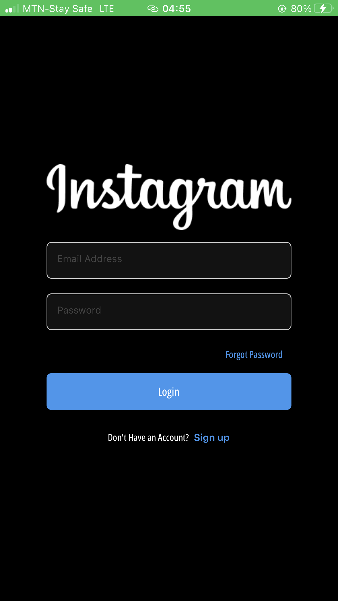
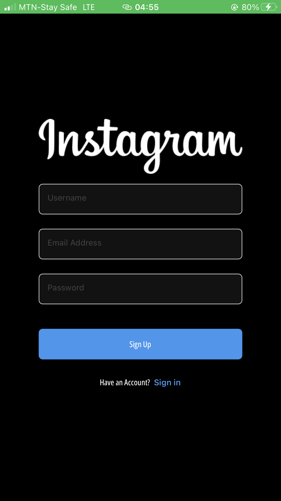
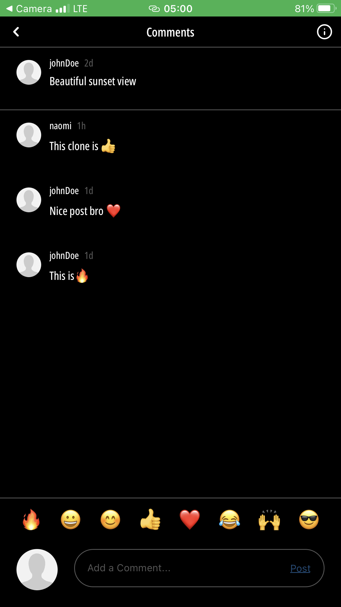
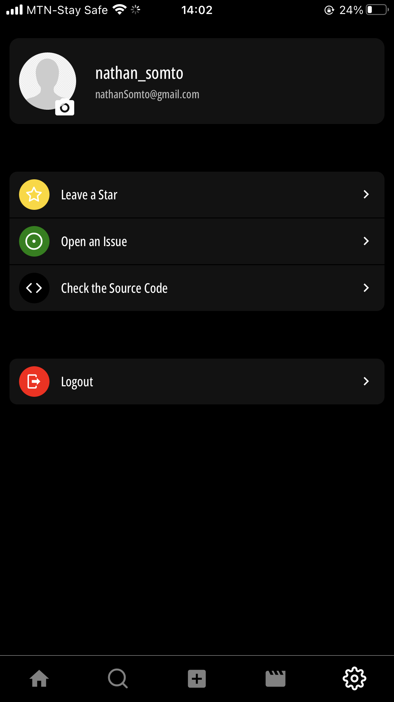

<div align="center">

  
  
  # Instagram React Native  Clone!
  
  <p>
Instagram Clone with REACT NATIVE! ( Navigation, Context api, Firebase & Expo)
  </p>
  
  


<a href="#" target="_blank"></a>


<h4>
    <a href="">View Demo</a>
  <span> · </span>
    <a href="https://github.com/blob/master/Nathan-Somto/Instagram-rn-clone/README.md">Documentation</a>
  <span> · </span>
    <a href="https://github.com/Nathan-Somto/Instagram-rn-clone/issues">Report Bug</a>
  <span> · </span>
    <a href="https://github.com/Nathan-Somto/Instagram-rn-clone/issues">Request Feature</a>
  </h4>
</div>

## :notebook_with_decorative_cover: Table of Contents

- [About the Project](#star2-about-the-project)
  - [Screenshots](#camera-screenshots)
  - [Tech Stack](#books-tech)
  - [Features](#sparkles-features)
- [Getting Started](#car-getting-started)
   - [Installation](#gear-installation)
- [Contributors](#busts_in_silhouette-contributors)
 <!--  - [Deployment](#triangular_flag_on_post-deployment) -->

<!-- #### 🔴 Open the camera app on your device and scan the code below (live demo) -->

## :construction: Status
Finished Developing
Yet to Publish :cry:
## :star2: About the Project

### :camera: Screenshots

#### Welcome Screen
<div align="center">
   
</div>

#### Sign in Screen
   <div align="center">
   
</div>

#### Sign up Screen

   <div align="center">
   
</div>

#### Home Screen
 <div align="center">
   
   
</div>

#### Comments Screen
  <div align="center">
   
</div>

#### New Post Screen

<div align="center">
   
</div>

#### Search Screen
 <div align="center">
   
</div>

#### Reels Screen
 <div align="center">
   
</div>

#### Settings Screen
 <div align="center">
   
</div>

## :sparkles: Features
- [x]  Create Posts 
- [x] Take a picture from your camera  or camera library.
- [x] Comment on Posts functionality.
- [x] Like Posts functionality
-  [x] View all Posts functionality.
-  [x] Authentication functionality.
- [x] Dark mode by default (Cause why not?)
- [x] Ui clone
- [x] Form validation
- [ ] Profile image update functionality.
- [x] Stack Navigation
-  [x] Tab Navigation


## :books: Tech
 What i used for the project.
<details>
  <summary>Front End</summary>
  <ul>
    <li><a href="https://www.typescriptlang.org/">Typescript</a></li>
    <li><a href="https://docs.expo.dev/workflow/expo-cli">Expo</a></li>
    <li><a href="https://reactnative.dev">React Native</a></li>
     <li><a href="https://formik.org/docs/guides/react-native">Formik</a></li>
     <li><a href="https://www.npmjs.com/package/yup">Yup</a></li>
     <li><a href="https://reactnavigation.org/docs/">React Navigation</a></li>
  </ul>
</details>


<details>
  <summary>Back End</summary>
  <ul>
    <li><a href="https://www.firebase.com/">Firebase</a></li>
  </ul>
</details>

## :car: Getting Started

### :gear: Installation

1. Clone my Repo
```bash
  git clone https://github.com/Nathan-Somto/Instagram-RN-clone.git

```
2. Install Expo globally

```bash
npm install --global expo
```

3. Enter into the Project

```bash
   cd Instagram-RN-clone
```

4. Install all dependencies

```bash
   npx expo install
```

5. Start the server

```bash
   expo start
```

## :busts_in_silhouette: Contributors
- [Nathan Somto](https://github.com/nathan-somto)
